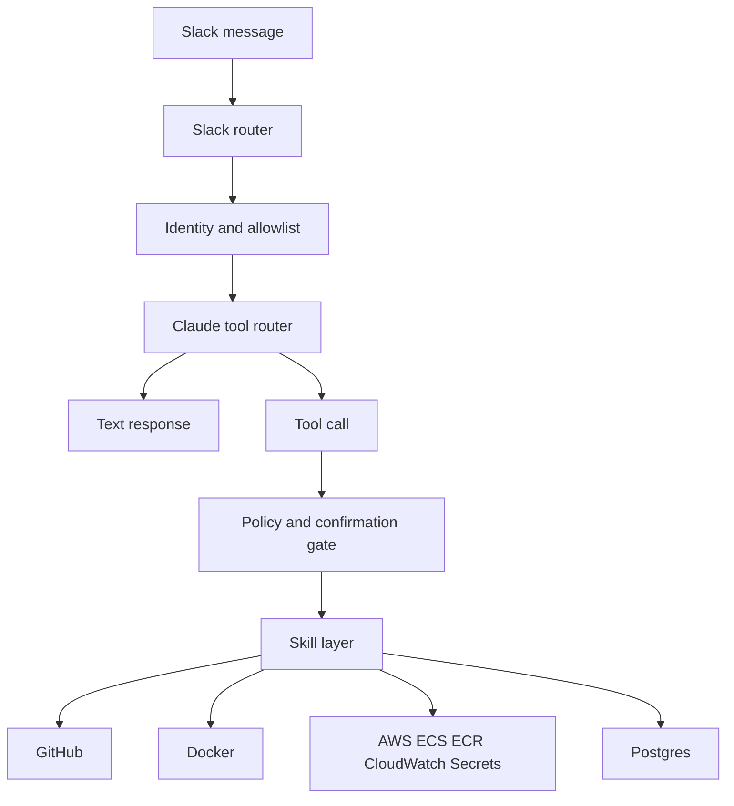

# Tangent Architecture Audit

Date: 2026-05-03

## Executive Summary

Tangent's core architecture makes sense for an OpenClaw-like internal deployment agent. The cleanest idea in the repo is also the riskiest one: Claude is the router, while `slack-bot.ts` enforces runtime policy and `src/skills/*` perform the actual work. That gives the system a natural builder UX, but it means safety depends on the consistency of three layers: prompt instructions, tool schemas, and executor gates.

The deployment path is coherent: inspect/analyze, build Docker image, push to ECR, register an ECS Fargate task definition with an ngrok sidecar, wait for tunnel readiness, then run a post-deploy health check. The skill layer is a good boundary. The main improvement areas are policy drift, trust-boundary hardening, config-driven infrastructure, and deleting or quarantining the unused MCP package.

Top priorities:

- Treat the HTTP API as a privileged automation surface. It currently bypasses Slack identity, confirmation, and pre-deploy analysis.
- Centralize action policy so prompts, docs, and executor gates cannot disagree about who may deploy, stop, edit, or run shell.
- Move account-specific infrastructure values out of prompts and code into config.
- Delete `mcp/` if it is truly unused, plus root scripts/dependencies/docs that keep it alive.
- Split `slack-bot.ts` into policy, router, tool execution, and Slack presentation modules before adding more tools.

## Architecture Read

The high-level shape is sound:

Important boundaries:

- `src/services/ai.ts` defines the LLM contract: tool schemas, system prompt, tool-call normalization, chained tool reasoning, deploy analysis, and failure summarization.
- `src/services/slack-bot.ts` is the runtime orchestrator: Slack events, identity prefixing, allowlist, pending confirmations, tool dispatch, chained execution, self-editing, bash, DB operations, and post-deploy auto-fix.
- `src/skills/*` is the action layer. This is the healthiest boundary in the codebase because it mostly avoids Slack-specific behavior.
- `src/routes/*` is a second interface, but it does not share the same policy or analysis path as Slack.
- `mcp/` is a nested package that bridges local MCP to Slack. It is mostly isolated from the main app.

## Findings

### Critical: HTTP Deploy And Teardown Bypass The Agent Safety Model

`src/routes/deploy.ts` and `src/routes/teardown.ts` expose mutation paths that do not use Slack identity, allowlist, confirmation, or Daanish-only teardown policy. `POST /deploy` also skips `runDeployAnalysis`, port auto-detection from `inspectRepo`, the richer deploy UX, and the post-deploy `quickHealthCheck`.

This creates two separate products:

- Slack Tangent: identity-aware, conversational, gated, analyzed.
- HTTP Tangent: network-trusted, direct, less checked.

That can be fine if the HTTP server is only bound to localhost and used by trusted scripts, but the code should make that trust boundary explicit. Today it is easy to accidentally expose a powerful unauthenticated deploy API.

Recommendation:

- Either remove mutation HTTP routes or require a shared secret/API token plus audit logging.
- Move Slack and HTTP deploys through a shared `deployWorkflow` service so analysis, port resolution, deploy, tunnel, notification, and health checks stay consistent.
- If HTTP is intended only for smoke tests/local automation, document it as localhost-only and bind to `127.0.0.1` in production.

### High: Policy Is Split Across Prompt, Docs, And Executor Code

The repo contains several policy sources that disagree:

- README and `mcp/README.md` say deploys require Daanish approval.
- `src/services/ai.ts` says any allowed user can request and approve deploys.
- `src/services/slack-bot.ts` enforces any authorized user can approve deploys because deploy pending confirmations have no `requiredApproverId`.
- `src/services/ai.ts` says `put_secret` and `inject_secret` can be used by any authorized user, while README still describes them as Daanish-only.
- `src/services/ai.ts` describes teardown as permanent removal and task definition deregistration, but `src/skills/teardown.ts` only scales desired count to zero.

This is not just documentation drift. The LLM uses the prompt and tool descriptions to decide what to call. If those descriptions are wrong, the agent can ask for or narrate the wrong action even if the final executor is safer.

Recommendation:

- Create a single action policy table in code, for example `src/policy/actions.ts`.
- Make route gates, prompt generation, tool descriptions, and docs derive from that policy where practical.
- Fix the teardown tool description immediately to say scale to zero, never delete.
- Decide explicitly whether deploys and secret writes are Daanish-only or any authorized user.

### High: `slack-bot.ts` Is Carrying Too Many Responsibilities

`src/services/slack-bot.ts` is the operational heart of Tangent, but it mixes:

- Slack event routing.
- Identity and active-thread state.
- Conversation memory.
- Confirmation state.
- Tool dispatch.
- Tool chaining.
- GitHub file mutation.
- Self-editing.
- Secret injection.
- DB administration.
- Bash execution.
- Logs/status rendering.
- Post-deploy auto-fix.

The code is thoughtfully written and has many good comments, but the module has become the policy kernel for the whole agent. That makes future safety changes hard because a tool can accidentally bypass a gate by entering through a different dispatch path.

Recommendation:

- Extract action policy and confirmation handling into `src/services/policy.ts`.
- Extract tool execution into `src/services/tool-executor.ts`.
- Extract Slack rendering/post/update helpers into `src/services/slack-presenter.ts`.
- Keep `slack-bot.ts` focused on Slack events, history building, identity prefixing, and routing.

### High: Hardcoded Infrastructure Values Limit Portability And Increase Drift

Several important values are hardcoded:

- `src/skills/deploy.ts` injects `DB_HOST: '10.40.40.123'` even though `src/config.ts` already has `pgHostInternalIp`.
- `src/skills/deploy.ts` hardcodes full account-specific Secrets Manager ARNs for `ANTHROPIC_API_KEY` and `NGROK_AUTHTOKEN`.
- `src/services/ai.ts` embeds `10.40.40.123` and tangent-specific infrastructure assumptions in prompts.
- `src/utils/constants.ts` hardcodes the allowed ECS cluster ARN.
- `.env.example` still references `impiricus-vibecode`.

Hardcoding was reasonable while proving the system, but it now creates hidden coupling between code, prompt behavior, IAM, and one AWS account.

Recommendation:

- Move shared app secret ARNs and ngrok secret ARN into config.
- Use `config().pgHostInternalIp` in deploy task env.
- Generate prompt infrastructure facts from config instead of literal strings.
- Update `.env.example` to match `tangent` defaults.
- Keep the cluster guard, but consider deriving the allowed ARN from account/region/cluster config and validating it at startup.

### Medium: Tool Chaining Is Powerful But Needs A More Explicit Capability Model

The chain logic is much better than a naive loop: it preserves `tool_use` and `tool_result` pairs, caps at 30 steps, validates truncated `push_file`/`push_self`, and blocks some gated tools from inline dispatch. That said, chain permissions are scattered across `executeToolCall`, `_chainIfNeeded`, `dispatchChainedTool`, `handleInfoTool`, and individual handlers.

The most important risk is adding a new tool and forgetting which paths can reach it. For example, `put_secret`, `inject_secret`, `db_create_user`, and `db_drop_user` are inline-chainable from `dispatchChainedTool`; they rely on handler-level checks where present.

Recommendation:

- Define per-tool metadata: `kind`, `risk`, `requiresConfirmation`, `requiredUser`, `dmOnly`, `chainable`.
- Have both direct dispatch and chained dispatch consult that metadata.
- Add tests that assert high-risk tools cannot run through an alternate path.

### Medium: Pre-Deploy Analysis Fails Open

`runDeployAnalysis` is a strong feature, especially for builder repos that are likely to have missing Dockerfiles, bad bind addresses, or wrong env assumptions. But if the AI analysis throws or returns bad JSON, `analyzeDeployEligibility` returns eligible and the deploy proceeds.

Fail-open may be good for availability, but it weakens the point of the analysis gate and could let obvious blockers through during Anthropic outages.

Recommendation:

- Fail closed for first deploys or repos without known-good prior deployments.
- Fail soft for redeploys of previously successful services.
- Persist deploy history so this distinction is based on data rather than conversation memory.

### Medium: Ngrok URL Registry Should Be Atomic

`src/skills/deploy.ts` persists stable URLs in `config/ngrok-urls.json` using sync read/write. Concurrent deploys can lose updates or corrupt the file. This is likely rare in single-process Slack usage, but the HTTP API and Slack can both deploy, and PM2 restarts can interrupt writes.

Recommendation:

- Write to a temp file and rename atomically.
- Add in-process locking around registry updates.
- Longer term, move deploy state to a small database table.

### Medium: Post-Deploy Auto-Fix Is Valuable But Too Implicit

`quickHealthCheck` can diagnose and push a code fix after a crash. The design is conservative in prompt wording, but it still pushes generated full-file content via `pushFile` without the normal `gatePushFile` shrink checks or human confirmation.

That is an intentional automation feature, but it has a different risk profile from "diagnose and suggest a fix."

Recommendation:

- Route auto-fix writes through the same content sanity checks as `push_file`.
- Consider requiring Daanish approval before pushing auto-fixes, or at minimum only auto-fix new/scaffold repos.
- Post a diff summary if possible, not only a description.

### Medium: Runtime Git Commits From The Bot Are Operationally Fragile

`allowUser` and `handleRememberPerson` edit JSON files, commit, and push from the running Tangent process. This is useful, but it ties runtime behavior to the process working directory, current branch, git credentials, and a clean checkout. Failure behavior is better than it used to be, but the model is still fragile.

Recommendation:

- Prefer storing runtime memory and allowlist in a small database or S3 object.
- If git-backed state remains, add a startup check for branch, remote, writeability, and dirty tree.
- Add an audit log entry for every runtime config mutation.

### Low: Monitoring And Docs Still Say `vibecode`

The code mostly uses `SERVICE_PREFIX = 'tangent-'`, but comments, README, `.env.example`, and `src/routes/health.ts` still refer to `vibecode-*`. The health route actually counts `vibecode-` ARNs, so it may report misleading service counts.

Recommendation:

- Change `/health` to count `SERVICE_PREFIX`.
- Update comments and `.env.example`.

### Low: MCP Package Is Removable If The Slack Bridge Is No Longer Used

The `mcp/` package is isolated. The main app does not import it. Coupling points are:

- Root `package.json` scripts: `build:mcp`, `build:all`.
- Root dependency: `@modelcontextprotocol/sdk`.
- Root `package-lock.json`.
- README sections and file tree entries.
- Slack compatibility parsing for `[MCP-USER: ...]` in `src/services/slack-bot.ts`.

Recommendation:

- Delete `mcp/`.
- Remove root MCP build scripts and dependency.
- Refresh `package-lock.json`.
- Remove README MCP sections.
- Keep `[MCP-USER: ...]` support for one release if there is any chance external clients still send it; otherwise remove it too.

## Suggested Implementation Sequence

### Phase 1: Policy And Docs Alignment

Do this first because it reduces confusion without changing the deployment architecture.

- Fix the teardown tool description.
- Decide and encode deploy approval policy.
- Decide and encode secret write/injection policy.
- Update README and `.env.example` to match reality.
- Fix `vibecode` leftovers, including `/health`.

### Phase 2: HTTP Trust Boundary

This is the most important safety improvement.

- Add authentication to mutation routes or remove them.
- Move HTTP deploy through the same deploy workflow as Slack.
- Add audit logging for every HTTP mutation.
- Make route behavior explicit in README.

### Phase 3: Config-Driven Infrastructure

This makes Tangent easier to maintain and safer to evolve.

- Add config fields for shared app secrets and ngrok secret ARN.
- Use `pgHostInternalIp` in `deploySkill`.
- Build infrastructure prompt facts from config.
- Validate required production config at startup.

### Phase 4: Tool Policy Refactor

This prepares the agent for more capabilities.

- Introduce a centralized action policy registry.
- Replace scattered direct/chained gate decisions with policy checks.
- Add focused tests for high-risk tools and chained execution.
- Split `slack-bot.ts` after policy extraction.

### Phase 5: State And Reliability

- Make `config/ngrok-urls.json` writes atomic or move deploy state to Postgres.
- Add deploy history for smarter analysis gating.
- Route auto-fix writes through the same file mutation guards as normal tool writes.
- Add more smoke/internal tests around deploy gating and prompt/tool drift.

### Phase 6: MCP Removal

- Delete `mcp/`.
- Remove root MCP scripts and dependency.
- Refresh `package-lock.json`.
- Remove README MCP documentation.
- Remove `[MCP-USER: ...]` parsing only if no external clients rely on it.

## Bottom Line

The repo is directionally strong. The core "Claude as router, Slack as UX, skills as action layer" design is appropriate for an internal deployment agent. The next step is not a rewrite. It is making policy explicit, reducing duplicated trust paths, and moving environment facts out of prompts and code. Once those are cleaned up, Tangent will be much easier to extend from a Slack DevOps helper into a more general autonomous builder deployment agent.
