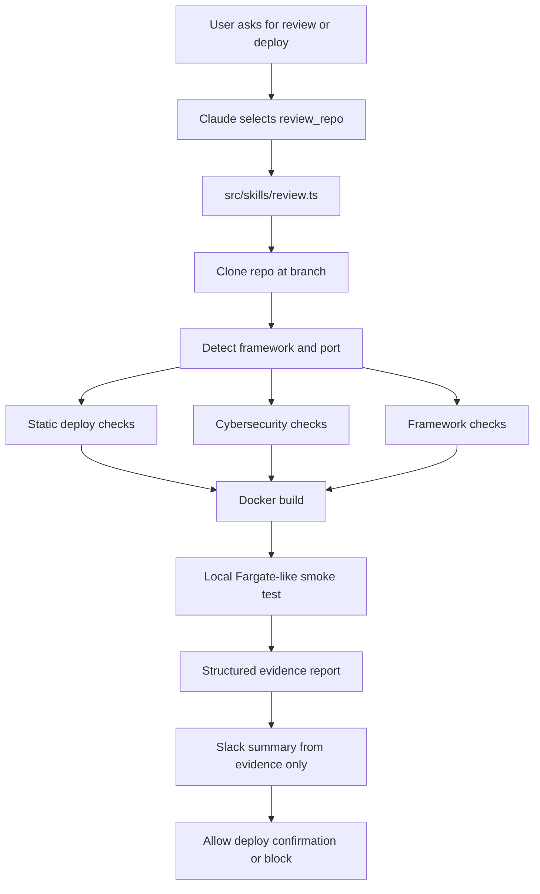
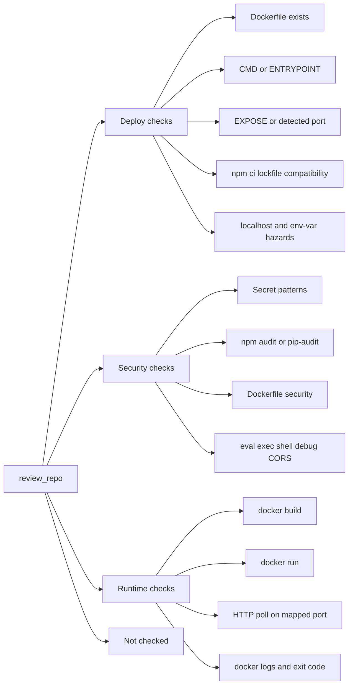
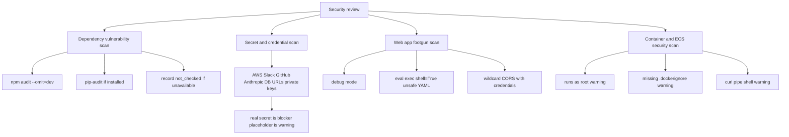
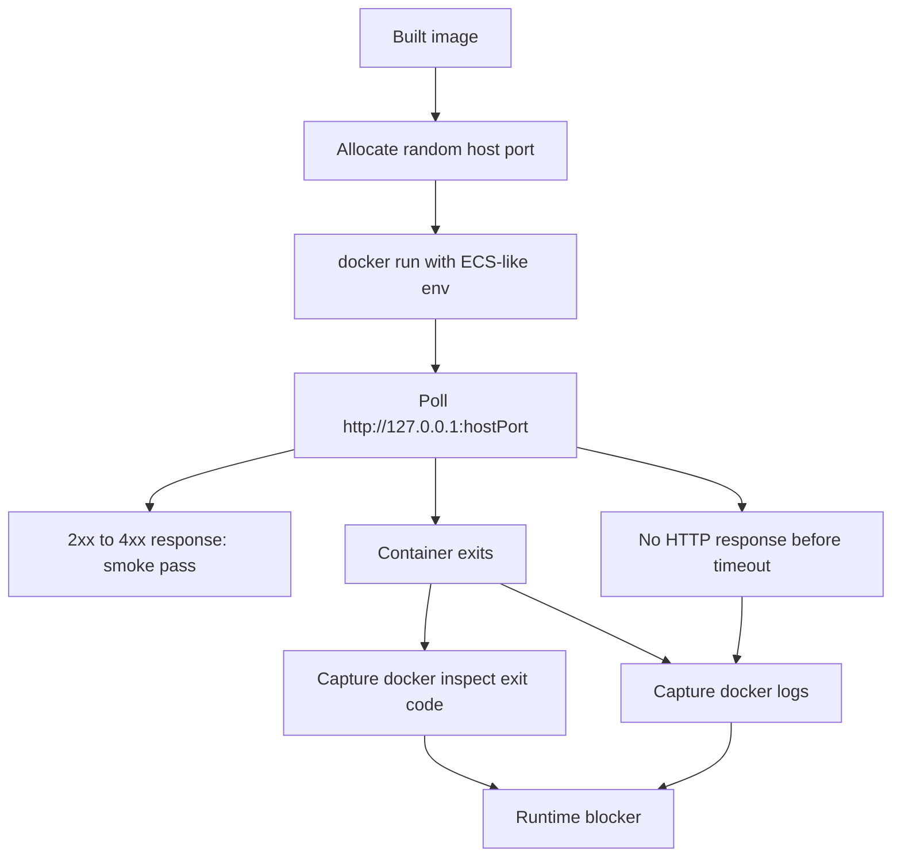
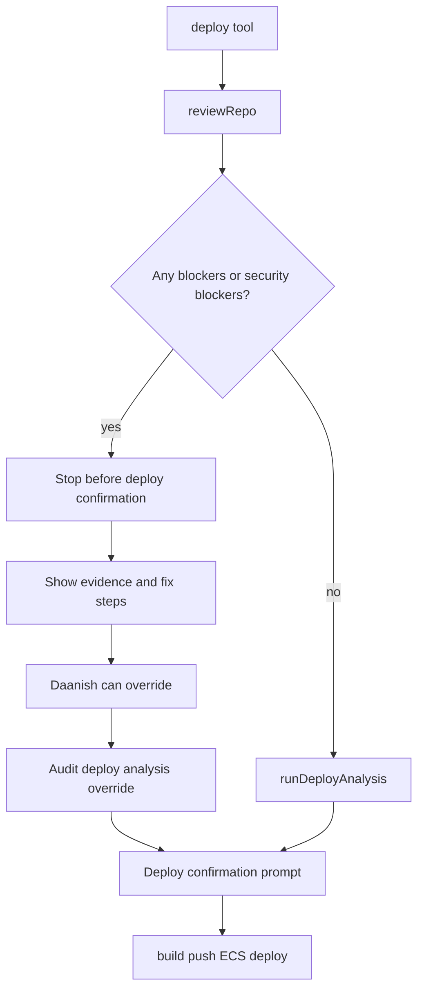

# Tangent

> **Impiricus's internal DevOps AI agent.** The AI version of Chris Tan (Employee #2). Lives in Slack, builds and deploys repos to ECS Fargate, monitors them, fetches logs, fixes broken services automatically, and answers DevOps questions in plain English.
>
> _Chris **TAN** + ag**ENT** = **TANGENT**._

---

## Table of contents

1. [What Tangent is](#what-tangent-is)
2. [Top-level architecture](#top-level-architecture)
3. [The deploy pipeline](#the-deploy-pipeline)
4. [Deploy review architecture](#deploy-review-architecture)
5. [Repository layout](#repository-layout)
6. [Runtime stack](#runtime-stack)
7. [The Slack bot — message flow](#the-slack-bot--message-flow)
8. [Tool catalogue (Claude tool-use)](#tool-catalogue-claude-tool-use)
9. [Skills (the action layer)](#skills-the-action-layer)
10. [Services (the integration layer)](#services-the-integration-layer)
11. [HTTP API](#http-api)
12. [Cron jobs](#cron-jobs)
13. [Safety model](#safety-model)
14. [Identity, access control & approvals](#identity-access-control--approvals)
15. [Memory & personalisation](#memory--personalisation)
16. [Self-healing: post-deploy auto-fix](#self-healing-post-deploy-auto-fix)
17. [Dashboard](#dashboard)
18. [Configuration & secrets](#configuration--secrets)
19. [Local development](#local-development)
20. [Production deployment (EC2 + PM2)](#production-deployment-ec2--pm2)
21. [IAM policy](#iam-policy)
22. [File reference](#file-reference)

---

## What Tangent is

Tangent is a TypeScript service that combines:

- **A Slack bot** (Bolt + Socket Mode) — the primary UX. Talk to it like a person.
- **A Fastify HTTP API** — programmatic deploy / teardown / status / list / health endpoints.
- **A Claude-powered router** — every Slack message goes to Claude Sonnet 4.6 with a tool-use schema; Claude either replies conversationally or calls one of ~20 DevOps tools.
- **A skill layer** — discrete units of work (`review`, `build`, `deploy`, `tunnel`, `teardown`, `monitor`, `scan`, `discover`) that talk to AWS, Docker, GitHub, ngrok.
- **Two cron jobs** — health-check every 5 min, CVE scan nightly at 02:00 UTC.

The unifying idea: **the LLM is the router.** There is no separate intent-classification step. Claude looks at the conversation history, the user's identity, the available tools, and decides what to do.

---

## Top-level architecture

```mermaid
flowchart TD
  Slack["Slack DMs, mentions, threads"] -->|"Socket Mode events"| SlackBot["Slack Bot\nsrc/services/slack-bot.ts"]
  SlackBot -->|"chat.postMessage and chat.update"| Slack
  Browser["VPN Browser"] -->|"Basic Auth"| Dashboard["Fastify Dashboard\n/dashboard"]
  Scripts["Scripts and CI"] -->|"Basic Auth or bearer token"| HttpApi["Fastify HTTP API\n/deploy /teardown /status /list /health"]

  subgraph tangentEc2 ["Tangent EC2: Node 24, TypeScript, PM2"]
    SlackBot -->|"identity, allowlist, confirmations"| Policy["Action Policy\nsrc/services/policy.ts"]
    Dashboard --> Auth["Auth Helpers\nsrc/services/auth.ts"]
    HttpApi --> Auth
    Auth --> Policy

    SlackBot -->|"message and history"| AI["Claude Router\nsrc/services/ai.ts\nSonnet 4.6 tools, Haiku consent"]
    MemoryContext["Memory Context\nsrc/services/memory-context.ts"] -->|"selected DB memories"| AI
    AI -->|"text reply"| SlackBot
    AI -->|"tool calls"| ToolExecutor["Tool Executor\nexecuteToolCall and chains"]
    ToolExecutor --> Skills["Skill Layer\nreview build deploy tunnel teardown monitor scan discover"]
    ToolExecutor --> Services["Integration Services\nGitHub AWS Docker Postgres Env Audit Conversations"]

    Dashboard --> EnvService["Environment Service\nSecrets create update inject"]
    Dashboard --> DashboardViews["Dashboard Views\nservices, secrets, conversations, memories, audit, memory runs"]
    HttpApi --> Skills

    CronHealth["Cron: health check\nEvery 5 minutes"] --> Skills
    CronCve["Cron: CVE scan\n02:00 UTC"] --> Skills
    CronMemory["Cron: memory summarize\n07:00 UTC"] --> MemoryService["Memory Service\nsrc/services/memories.ts"]

    Services --> Migrations["DB Migrations\nsrc/services/db-migrations.ts"]
    Migrations --> Postgres
    EnvService --> AwsSecrets
    MemoryService --> AI
    MemoryService --> Postgres
    MemoryContext --> Postgres
    DashboardViews --> Postgres
    Services --> Postgres
  end

  subgraph postgresBox ["Postgres on EC2: 10.40.40.123:5432"]
    Postgres["Schema: tangent_app"]
    Postgres --> ConversationMessages["conversation_messages\nSlack/user/assistant log"]
    Postgres --> ToolEvents["tool_events\ntool requests and results"]
    Postgres --> AuditEvents["audit_events\nmutations and ops"]
    Postgres --> AllowedUsers["allowed_users\nSlack allowlist"]
    Postgres --> ServiceUrls["service_urls\nstable ngrok URLs"]
    Postgres --> Memories["memories\nperson facts, preferences, decisions, project context"]
    Postgres --> MemorySources["memory_sources\nmemory to source-message links"]
    Postgres --> MemoryRuns["memory_runs\ncron/manual summarization history"]
    Postgres --> AppState["app_state\nlow-volume migration state"]
  end

  subgraph awsBox ["AWS Development Account"]
    Ecs["ECS Fargate Cluster"]
    Ecr["ECR Registry"]
    CloudWatch["CloudWatch Logs"]
    AwsSecrets["Secrets Manager\ntangent/*"]
    Iam["IAM Roles\nexecution and task roles"]
  end

  subgraph githubBox ["GitHub"]
    OrgRepos["Impiricus-AI repos\ninspect, read, edit, deploy"]
    TangentRepo["Tangent repo\nself-edit and source"]
  end

  subgraph dockerBox ["EC2 Docker CLI"]
    DockerBuild["docker build"]
    DockerPush["docker push"]
  end

  Skills -->|"clone, inspect, read, push"| OrgRepos
  Services -->|"Octokit"| OrgRepos
  Services -->|"self tools"| TangentRepo
  Skills -->|"build image"| DockerBuild
  DockerBuild --> DockerPush
  DockerPush --> Ecr
  Skills -->|"register task, update service"| Ecs
  Skills -->|"logs and health"| CloudWatch
  Skills -->|"secret injection"| AwsSecrets
  Ecs --> CloudWatch
  Ecs --> Iam
  Ecs --> DeployedTask["Each deployed service\napp container plus ngrok sidecar"]
  DeployedTask -->|"image"| Ecr
  DeployedTask -->|"runtime secrets"| AwsSecrets
  DeployedTask -->|"DB_HOST and DB_PORT"| Postgres
  DeployedTask --> Ngrok["ngrok stable URL\nGoogle OAuth domains"]
  Ngrok --> PublicUsers["Approved Google domains\nimpiricus.com and docupdate.io"]

  ConfigFiles["Fallback repo files\nconfig/people.json\nconfig/allowed_users.json\nconfig/ngrok-urls.json"] -. "bootstrap and fallback" .-> Services
  AuditJsonl["Fallback log file\nlogs/audit.jsonl"] -. "fallback audit trail" .-> Services
```



---

## The deploy pipeline

This is the most important flow in Tangent. End-to-end, what happens when someone says **"@Tangent deploy chatbot-test"**:

```
 Slack message
      │
      ▼
┌────────────────────────────────────────────────────────────────────────┐
│ 1. slack-bot.route()                                                   │
│      • Resolve real Slack user ID (identity prefix injected for Claude)│
│      • Access-control gate (allowlist in config/allowed_users.json)    │
│      • Build conversation history (Slack thread or in-memory DM store) │
└─────────────────────────────────┬──────────────────────────────────────┘
                                  ▼
┌────────────────────────────────────────────────────────────────────────┐
│ 2. ai.processMessage()  →  Claude Sonnet 4.6 with TOOLS schema         │
│      → returns { type: 'tool', call: { name: 'deploy', input: {...}} } │
└─────────────────────────────────┬──────────────────────────────────────┘
                                  ▼
┌────────────────────────────────────────────────────────────────────────┐
│ 3. Validate the repo exists in Impiricus-AI (listAllRepos)             │
│    Look up stored ngrok URL from config/ngrok-urls.json (stable URLs)  │
│    Post a confirmation prompt + ping <@Daanish> in #tangent-deployments│
│    Store pending action (10-min TTL) keyed by conversation             │
└─────────────────────────────────┬──────────────────────────────────────┘
                                  ▼ (Daanish replies "yes" / "ship it" / 👍)
┌────────────────────────────────────────────────────────────────────────┐
│ 4. classifyConsent(text) — fast regex, then Claude Haiku for fuzzy     │
│    yes  → executeToolCall(deploy)                                      │
│    no   → cancel, post "❌ Cancelled"                                  │
│    other→ treat as a brand new message                                 │
└─────────────────────────────────┬──────────────────────────────────────┘
                                  ▼
┌────────────────────────────────────────────────────────────────────────┐
│ 5. handleDeploy()  ─── posts a single rich Slack message that updates  │
│                       in place through every stage:                    │
│                                                                        │
│   stage = 'reviewing'  ─► reviewRepo({ repo, branch, port })           │
│       ├─ clone repo and inspect source                                 │
│       ├─ deterministic deploy checks                                   │
│       ├─ cybersecurity checks                                          │
│       ├─ docker build                                                  │
│       ├─ local container smoke test                                    │
│       └─ blockers/security blockers stop before deploy confirmation    │
│                                                                        │
│   stage = 'analyzing'  ─► runDeployAnalysis()                          │
│       └─ AI-assisted eligibility check backed by static evidence       │
│                                                                        │
│   stage = 'building'  ─►  buildSkill({ repo, branch })                 │
│       ├─ git clone --depth 1 (Octokit token)                           │
│       ├─ verify Dockerfile at root                                     │
│       ├─ ecrLogin() (writes ~/.docker/config.json — bypass keychain)   │
│       ├─ docker build --platform linux/amd64 -t <ecr>:<repo>-<sha> .   │
│       ├─ docker push (auto re-auth + retry on 401)                     │
│       └─ on failure → summarizeBuildError() via Claude → Slack         │
│                                                                        │
│   stage = 'deploying' ─►  deploySkill({ repo, imageUri, port })        │
│       ├─ assertAllowedCluster('tangent') — hard guardrail              │
│       ├─ resolveNgrokUrl() — reuse stored URL or generate new          │
│       ├─ ensureLogGroup()  — creates /ecs/<group> (30-day retention)   │
│       ├─ build container defs:                                         │
│       │     • app    : your image, secrets injected from Secrets Mgr   │
│       │     • ngrok  : ngrok/ngrok:latest sidecar with --url <stable>  │
│       │                  + Google OAuth (@impiricus.com)               │
│       ├─ inherit existing app secrets from previous task def revision  │
│       ├─ RegisterTaskDefinition (FARGATE, awsvpc)                      │
│       ├─ Create or UpdateService — minHealthyPct=0 so old task stops   │
│       │   first (avoids ngrok session collision on the stable URL)    │
│       └─ return { serviceName, taskDefArn, deployedAt, ngrokUrl }      │
│                                                                        │
│   stage = 'tunneling'─►  tunnelSkill({ repo, expectedUrl, deployedAt })│
│       ├─ HTTP-poll the pre-generated URL every 2s for up to 3 min      │
│       ├─ ngrok edge returns 404 + ERR_NGROK_3200 until tunnel is up    │
│       ├─ any other status (200, 502, …) → tunnel is live, return URL   │
│       └─ Fallback: scrape CloudWatch ngrok-* log streams (legacy path) │
│                                                                        │
│   stage = 'done'      ─►  ✅ <repo> is live at <url>                   │
│                            also notify #tangent-deployments            │
└─────────────────────────────────┬──────────────────────────────────────┘
                                  ▼
┌────────────────────────────────────────────────────────────────────────┐
│ 6. quickHealthCheck() — fires 15s after the tunnel comes up            │
│    • DescribeServices: any running tasks?                              │
│    • If runningCount === 0 → service crashed on startup                │
│         ├─ fetch ECS stopped task reasons + service events             │
│         ├─ fetch app + ngrok logs from CloudWatch                      │
│         ├─ Claude diagnoses root cause (diagnoseServiceFailure)        │
│         ├─ identifyFileToFix() — single file? confident fix?           │
│         ├─ generateCodeFix() — minimal patch, server-side push         │
│         └─ post diagnosis + auto-fix banner, ping <@Daanish>           │
└────────────────────────────────────────────────────────────────────────┘
```

Three things to notice:

1. **The ngrok URL is generated by Tangent _before_ the task starts** and persisted in `config/ngrok-urls.json`. This means the URL is stable across redeployments — the same `https://tangent-<repo>-XXXX.ngrok.app` every time, unless `freshUrl: true` is passed.
2. **Tunnel readiness is detected by HTTP-polling the URL itself**, not by scraping CloudWatch — much faster (~2s detection vs. 30s+ log delivery delay).
3. **`minimumHealthyPercent: 0`** in the deployment config: ECS stops the old task _before_ starting the new one. Without this, two tasks would briefly try to claim the same ngrok URL and the new one would die.
4. **Deploys are review-gated before build/push/deploy.** `review_repo` runs deterministic deploy, security, Docker build, and local smoke checks before Tangent opens a deploy confirmation.

---

## Deploy review architecture

The deploy review tool is Tangent's evidence gate. It exists because "I read the file and it looks good" is not enough. The review tool must produce concrete command output, static evidence, Docker build results, and smoke-test behavior before Tangent can confidently say a repo is deploy-ready.

### Review Tool Flow



### Deterministic Check Layers



The output is split into:

- `Blockers`: verified deploy/runtime failures, such as missing Dockerfile, Docker build failure, container exit, or no reachable HTTP response.
- `Security blockers`: high-confidence secrets, obvious RCE patterns, or critical deploy-relevant security failures.
- `Security warnings`: non-blocking security risks like missing `.dockerignore`, root containers, or lower-confidence dependency findings.
- `Warnings`: non-security issues that are worth fixing but should not block deploy.
- `Not checked`: tools unavailable or inconclusive checks. This never becomes a pass.

### Security Review Flow



### Local Fargate-Like Smoke Test



The smoke test injects the same basic environment shape Tangent gives ECS tasks, including `PORT`, `APP_PORT`, `DB_HOST`, `DB_PORT`, and placeholders for shared app secrets. It does not replace production ECS health, but it catches the common "builds fine, dies instantly in container" class before deployment.

### Deploy Gate With Override



The override path is intentionally still available for Daanish, but the normal path blocks before ECR/ECS mutation when there is deterministic evidence that the repo will fail or has a serious security issue.

---

## Repository layout

```
tangent/
├── src/                          ← Main service (TypeScript, ESM)
│   ├── index.ts                  ← entry: load config → init clients → start Fastify + Slack + cron
│   ├── server.ts                 ← Fastify factory (used by index + tests)
│   ├── config.ts                 ← env + Secrets Manager loader, allowUser(), peopleNotes
│   │
│   ├── routes/                   ← Fastify HTTP API
│   │   ├── health.ts             GET  /health
│   │   ├── deploy.ts             POST /deploy  → build → deploy → bg tunnel → slack
│   │   ├── teardown.ts           POST /teardown
│   │   ├── status.ts             GET  /status/:repo
│   │   └── list.ts               GET  /list
│   │
│   ├── skills/                   ← The action layer (no Slack, no HTTP — pure work)
│   │   ├── review.ts             deploy/security review → Docker build → local smoke test
│   │   ├── build.ts              clone → verify Dockerfile → ECR login → build → push
│   │   ├── deploy.ts             register task def → create/update service → ngrok URL registry
│   │   ├── tunnel.ts             HTTP-poll the pre-generated URL (CloudWatch fallback)
│   │   ├── teardown.ts           scale ECS service to 0 (NEVER deletes)
│   │   ├── monitor.ts            list tangent-* services, alert if degraded > 10 min
│   │   ├── scan.ts               clone scaffold-child repos → pip-audit + npm audit
│   │   └── discover.ts           scan config for placeholders, query AWS, suggest real values
│   │
│   ├── services/                 ← Integration layer (talks to external systems)
│   │   ├── ai.ts          ★      Anthropic SDK wrapper — TOOLS schema, system prompt, all
│   │   │                         Claude calls (processMessage, continueAfterTool,
│   │   │                         classifyConsent, diagnoseServiceFailure, identifyFileToFix,
│   │   │                         generateCodeFix, summarize{Build,Deploy}Error)
│   │   ├── slack-bot.ts   ★      Bolt Socket Mode app, router, confirmation store,
│   │   │                         executeToolCall, handleDeploy/Teardown/PushFile/...,
│   │   │                         in-memory conversation store, identity prefixing,
│   │   │                         post-deploy auto-fix
│   │   ├── slack.ts              Web API + Block Kit notification helpers
│   │   ├── github.ts             Octokit: cloneRepo, listAllRepos, inspectRepo,
│   │   │                         pushFile, readRepoFile, listCommits, scaffold-child topic
│   │   ├── aws.ts                ECS / ECR / SM / CWL client singletons
│   │   └── docker.ts             ECR token → ~/.docker/config.json (bypass keychain),
│   │                             docker build/push with auto-retry
│   │
│   ├── cron/                     ← node-cron schedules
│   │   ├── health-check.ts       */5 * * * *  → monitorSkill
│   │   └── cve-scan.ts           0 2 * * *   → scanSkill
│   │
│   └── utils/
│       ├── logger.ts             pino + pino-pretty
│       ├── exec.ts               execFile wrapper (no shell — injection-safe), 50 MB buffer
│       ├── constants.ts          SERVICE_PREFIX, ALLOWED_CLUSTER, NGROK_IMAGE, timeouts
│       └── safety.ts             assertAllowedCluster() — hard guard before any ECS write
│
├── config/                       ← Persistent state (committed to git)
│   ├── allowed_users.json        Slack user IDs who may talk to Tangent
│   ├── people.json               long-term memory notes per Slack user ID
│   └── ngrok-urls.json           { repo: stable-ngrok-url } registry
│
├── scripts/
│   ├── setup.sh                  idempotent EC2 bootstrap (Node, PM2, Docker, pip-audit)
│   ├── smoke-test.sh             end-to-end smoke test
│   └── iam-policy.json           IAM policy attached to Tangent's EC2 instance role
│
├── slack-app-manifest.json       Slack app definition (Socket Mode, scopes, events)
├── pm2.config.cjs                PM2 ecosystem file (production)
├── .env.example                  documented env var template
├── tsconfig.json                 strict TS, NodeNext modules
└── package.json
```

---

## Runtime stack

| Layer       | Choice                                                          |
|-------------|-----------------------------------------------------------------|
| Runtime     | Node.js 24 (ESM, `--experimental-vm-modules`)                   |
| Language    | TypeScript 5.8 (`tsc` only — no bundler)                        |
| HTTP        | Fastify 5                                                       |
| Slack       | `@slack/bolt` 4 (Socket Mode) + `@slack/web-api` 7              |
| LLM         | `@anthropic-ai/sdk` 0.39 — Sonnet 4.6 (router, synthesis, fix)  |
|             |                            — Haiku 4.5 (consent classifier)    |
| AWS SDK v3  | ECS · ECR · CloudWatch Logs · Secrets Manager · IAM · EC2       |
| GitHub      | `@octokit/rest` 21                                              |
| Cron        | `node-cron` 3                                                   |
| Logging     | `pino` + `pino-pretty`                                          |
| Process mgr | PM2 (`pm2.config.cjs`)                                          |

---

## The Slack bot — message flow

`src/services/slack-bot.ts` is the heart of the user experience. ~1500 lines of carefully ordered routing logic. Here's the mental model:

### Channels & subscriptions

The bot subscribes to two Slack events:

- `app_mention` — anywhere `@Tangent` is mentioned
- `message.im` — any DM to Tangent

Plus it tracks **active threads**: once Tangent replies in a channel thread, it joins that thread for the rest of its TTL (30 min) — users no longer need to `@mention` it for follow-ups.

### Conversation memory

Two stores live side by side:

| Source             | Storage                                           | Why                                                         |
|--------------------|---------------------------------------------------|-------------------------------------------------------------|
| Channel threads    | Slack `conversations.replies` API on every msg   | Naturally bounded, accurate, survives Tangent restarts      |
| Direct messages    | In-memory `Map<channel, ConvEntry>` (TTL 30 min) | Slack DM history is unbounded — would pull stale context   |

Conversations cap at **12 turns**. Every historical user message is rewritten with an identity prefix (`[Slack User: <@ID> | ID: ...]`) so Claude can always tell who said what — even messages from earlier in the thread.

### The router (`route()`)

```
                  ┌──────────────────────────────────────┐
                  │           Slack event arrives        │
                  └──────────────────┬───────────────────┘
                                     ▼
                  ┌──────────────────────────────────────┐
                  │ Resolve real Slack user ID           │
                  └──────────────────┬───────────────────┘
                                     ▼
                  ┌──────────────────────────────────────┐
                  │ Access-control gate                  │
                  │ allowedSlackUserIds (file + runtime) │
                  └──────────────────┬───────────────────┘
                                     ▼
            ┌────────────────────────────────────────────┐
            │ "add @user" / "allow @user"  →  Daanish only│
            │ allowUser() → persist + git push           │
            └────────────────────────┬───────────────────┘
                                     ▼
            ┌────────────────────────────────────────────┐
            │ Pending confirmation? (deploy / teardown / │
            │  push_file overwrite)                      │
            │   classifyConsent() → confirm | cancel | …  │
            └────────────────────────┬───────────────────┘
                                     ▼ (no pending action)
            ┌────────────────────────────────────────────┐
            │ buildHistory() → identity-prefix message    │
            │ processMessage() → Claude tool-use call    │
            └────────────────────────┬───────────────────┘
                            ┌────────┴───────────┐
                            ▼                    ▼
                       (text reply)         (tool call)
                            │                    │
                            ▼                    ▼
                   Post in thread        ┌──── deploy / teardown / push_file (existing) ────┐
                                         │ Show confirmation prompt + ping approver         │
                                         │ Store pending (TTL 3 min)                        │
                                         └──────────────────────────────────────────────────┘
                                                         OR
                                         ┌──── any other tool ──────────────────────────────┐
                                         │ executeToolCall() in background                  │
                                         │ informational tools → fetchToolData →            │
                                         │   continueAfterTool() → text OR another tool     │
                                         │   (multi-step agent loops)                       │
                                         └──────────────────────────────────────────────────┘
```

### Confirmation gates

| Action                          | Who can confirm | Notes                                                         |
|---------------------------------|-----------------|---------------------------------------------------------------|
| `deploy`                        | Daanish only    | Anyone may request; Daanish must reply *yes* in 3 min         |
| `teardown`                      | Daanish only    | Daanish must even *initiate* it                               |
| `push_file` (file exists)       | Daanish only    | New files commit immediately, no prompt                       |
| `put_secret`                    | Daanish only    | Daanish asking IS the authorisation — no extra prompt         |
| `inject_secret`                 | Daanish only    |                                                               |
| `allow_user`                    | Daanish only    | Persists to `config/allowed_users.json` + git push to main    |
| Everything else                 | Anyone allowed  | Runs immediately                                              |

---

## Tool catalogue (Claude tool-use)

Defined in `src/services/ai.ts` → `TOOLS`. Claude sees these and decides which to call.

| Tool                | Type   | What it does                                                                              |
|---------------------|--------|-------------------------------------------------------------------------------------------|
| `deploy`            | action | Build a repo from GitHub, push to ECR, deploy as ECS Fargate service with ngrok tunnel    |
| `teardown`          | action | Scale an ECS service to 0 (preserves service + task defs — never deletes)                 |
| `status`            | info   | Health + running task count for one repo (auto-attaches app logs if degraded)             |
| `list_services`     | info   | All `tangent-*` services with health                                                      |
| `list_repos`        | info   | All repos in the Impiricus-AI org, sorted by recent activity                              |
| `inspect_repo`      | info   | README + Dockerfile + package.json/requirements.txt + top-level files + detected EXPOSE port |
| `review_repo`       | info   | Evidence-backed deploy/security review: static checks, audits, Docker build, smoke test   |
| `cve_scan`          | info   | On-demand pip-audit + npm audit across scaffold-child repos                               |
| `discover_config`   | info   | Find missing config values by querying ECR / ECS / CloudWatch                             |
| `logs`              | info   | Recent CloudWatch logs (`app` or `ngrok` container)                                       |
| `clear_logs`        | info   | Delete stale log streams for a repo                                                       |
| `push_file`         | action | Create/update one file via the GitHub Contents API (gates if file exists)                 |
| `read_file`         | info   | Read any file from a GitHub repo, optionally at a historical commit SHA                   |
| `list_commits`      | info   | Recent commits for a repo, optionally filtered to a specific path                         |
| `restore_file`      | action | Restore a file to its content at a previous commit — server-side, no LLM round-trip       |
| `list_secrets`      | info   | Secret **names** in AWS Secrets Manager (never values)                                    |
| `put_secret`        | action | Create/update a secret in Secrets Manager (Daanish only)                                  |
| `inject_secret`     | action | Wire a Secrets Manager secret as an env var into a deployed ECS service (Daanish only)    |
| `allow_user`        | action | Add a Slack user ID to the allowlist + persist to git (Daanish only)                      |
| `remember_person`   | action | Save a long-term note about someone to `config/people.json` (memory)                      |

### Multi-step agent loops

Informational tools don't just dump data. After an info tool returns, `continueAfterTool()` feeds the result back to Claude with the same TOOLS schema — Claude can either reply with text **or call another tool**. This is what enables chains like:

> **User:** "Add a Dockerfile to chatbot-test that exposes port 3000."
> 1. Claude calls `inspect_repo("chatbot-test")` to see the existing files.
> 2. `continueAfterTool()` runs — Claude now sees the file list and decides to call `push_file` with a generated Dockerfile.
> 3. Slack message updates with the commit URL.

Or:

> **User:** "Recover main.py — I just deleted it."
> 1. `list_commits("repo", path="main.py")` → finds the last good SHA
> 2. `restore_file("repo", "main.py", ref=<sha>)` → server-side read + push, no content passes through the LLM context (so nothing can be lost or truncated).

---

## Skills (the action layer)

Skills know nothing about Slack or HTTP. They're pure functions that take an input object, do work, and return a result object. They're called by both the Slack bot and the HTTP API.

### `review.ts`

```
reviewRepo({ repo, branch, port })
  ├─ clone repo with sanitized git errors
  ├─ inspect Dockerfile, package files, Python files, source tree
  ├─ run deterministic deploy checks
  │    ├─ Dockerfile exists
  │    ├─ CMD or ENTRYPOINT exists
  │    ├─ EXPOSE or supplied/detected port exists
  │    └─ npm ci has package-lock.json when required
  ├─ run framework checks
  │    ├─ python3 -m compileall
  │    └─ npm ci && npm run build when package-lock.json exists
  ├─ run security checks
  │    ├─ npm audit / pip-audit when available
  │    ├─ hardcoded secret patterns
  │    ├─ debug/eval/exec/shell/YAML/CORS footguns
  │    └─ Dockerfile hygiene
  ├─ docker build
  └─ docker run + HTTP smoke test
returns { canDeploy, blockers, securityFindings, warnings, notChecked, commandsRun }
```

This skill is intentionally more deterministic than the older AI deploy analyzer. Claude can decide when to call it and can summarize its results, but the pass/fail evidence comes from source inspection and commands.

### `build.ts`

```
buildSkill({ repo, branch })
  └─ workspaceDir/<repo>-<timestamp>/
       ├─ git clone --depth 1 --branch <branch>
       ├─ access(Dockerfile)            ← throws DockerfileNotFoundError
       ├─ ecrLogin()                    ← see services/docker.ts
       ├─ docker build --platform linux/amd64 -t <ecr>:<repo>-<sha> .
       │     on failure → summarizeBuildError() via Claude → DockerBuildError
       └─ docker push (auto-retry once after re-auth)
  finally:
       └─ rm -rf cloneDir
returns { imageUri, sha, buildTimeMs }
```

### `deploy.ts`

The longest skill. Highlights:

- **Stable ngrok URLs.** `resolveNgrokUrl()` checks `config/ngrok-urls.json`. If a URL exists for this repo and `freshUrl !== true`, reuse it. Otherwise mint `tangent-<repo>-<8 hex chars>.ngrok.app` and persist.
- **Inherited secrets.** When updating a service, `fetchExistingAppSecrets()` reads the previous task definition and carries forward any secrets that were on it — minus duplicates of the cluster-wide shared list (currently `ANTHROPIC_API_KEY`). This means Tangent can `inject_secret` once and not lose it on the next deploy.
- **Task definition shape:** `awsvpc` networking, FARGATE, two `essential: true` containers (`app` + `ngrok`), `awslogs` driver, distinct stream prefixes per repo per container.
- **Deployment configuration:** `minimumHealthyPercent: 0`, `maximumPercent: 100`, `availabilityZoneRebalancing: 'DISABLED'`. Stop the old task first to free the ngrok session.
- **Pre-deploy guard:** `assertAllowedCluster('tangent')`.

### `tunnel.ts`

```
                 expectedUrl supplied?
                       │
                ┌──────┴──────┐
                ▼             ▼
             yes (fast)    no (legacy)
                │             │
        HTTP poll the URL    Scrape CloudWatch
        every 2 s            ngrok-* log streams
                │             │
        ngrok 404 + ERR_NGROK_3200  → wait
        anything else               → return URL
                │
        timeout (default 180s) → TunnelTimeoutError
```

### `teardown.ts`

`UpdateService(desiredCount: 0)` followed by `waitForTasksDrained()` (max 60 s). **Never** calls `DeleteService` or `DeregisterTaskDefinition`.

### `monitor.ts`

Cron-driven (`*/5 * * * *`). Lists every `tangent-*` service, describes them in batches of 10, and tracks an in-memory `degradedSince` map. If a service stays `running < desired` for **10 minutes**, alert Slack with the latest stop reason (pulled from the most recent stopped task's container reason).

### `scan.ts`

Cron-driven (`0 2 * * *`). For every repo with the `impiricus-scaffold-child` GitHub topic:

1. Shallow-clone.
2. Run `pip-audit --format json --no-deps` if `requirements.txt` or `pyproject.toml` exists.
3. Run `npm audit --json` if `package.json` exists.
4. Filter to `HIGH`/`CRITICAL` only.
5. Post per-repo findings + a final summary to `#ai-engineering` (or wherever `SLACK_CHANNEL` points).

### `discover.ts`

A **bootstrap helper** for fresh installs. Scans the loaded config for `REPLACE_ME` / `subnet-local` / etc. placeholders, then queries AWS to fill them in:

- ECR repos → suggest one matching the cluster name
- Existing ECS services → harvest subnets + security groups
- Existing task definitions → harvest the execution role ARN
- CloudWatch → confirm the log group exists

Returns suggestions, surfaced AWS errors (never swallowed), and a `missing` list.

---

## Services (the integration layer)

| File             | Responsibility                                                                                       |
|------------------|------------------------------------------------------------------------------------------------------|
| `aws.ts`         | Singleton AWS SDK clients: ECS, ECR, Secrets Manager, CloudWatch Logs.                              |
| `github.ts`      | Octokit auth, `cloneRepo`, `listAllRepos`, `inspectRepo`, `pushFile`, `readRepoFile`, `listCommits`, `listScaffoldChildRepos`. `inspectRepo` also extracts the Dockerfile `EXPOSE` port — the source of truth for deploy port. |
| `docker.ts`      | The interesting one: instead of `docker login`, gets an ECR token via the SDK and writes it directly into `~/.docker/config.json` under `auths`, plus a `credHelpers` override for the registry. This bypasses the macOS Keychain helper that otherwise breaks ECR auth. Then `dockerBuild` and `dockerPush` shell out to the local Docker CLI. |
| `slack.ts`       | Block Kit notification helpers: `notifyDeployed`, `notifyDeployUrl`, `notifyDeployError`, `notifyTeardown`, `notifyHealthAlert`, `notifyCveScan`, `notifyCveScanSummary`. |
| `slack-bot.ts`   | The Bolt Socket Mode app, conversation router, confirmation store, executors, post-deploy health check, all the `handleX` functions, and the `fetchToolData` data fetcher used by informational tools. |
| `ai.ts`          | Every Claude call. The `TOOLS` array is the contract with the LLM. The `SYSTEM_PROMPT_BASE` is Tangent's personality. `withRetry()` wraps every call with exponential backoff on 429/529. |

### What lives in `ai.ts`

| Function                  | Model            | Used by                                                |
|---------------------------|------------------|--------------------------------------------------------|
| `processMessage`          | `claude-sonnet-4-6` | every Slack message                                 |
| `synthesizeToolResult`    | `claude-sonnet-4-6` | (older path) turn raw tool data into prose          |
| `continueAfterTool`       | `claude-sonnet-4-6` | informational tools — enables tool-chaining loops    |
| `classifyConsent`         | `claude-haiku-4-5`  | yes/no detection on confirmation prompts            |
| `diagnoseServiceFailure`  | `claude-sonnet-4-6` | post-deploy health check, root-cause from logs      |
| `identifyFileToFix`       | `claude-sonnet-4-6` | post-deploy auto-fix — picks the file to edit        |
| `generateCodeFix`         | `claude-sonnet-4-6` | post-deploy auto-fix — generates the patch           |
| `summarizeBuildError`     | `claude-sonnet-4-6` | docker build failures → human-readable summary      |
| `summarizeDeployError`    | `claude-sonnet-4-6` | deploy step failures → human-readable summary       |

---

## HTTP API

A second interface, useful for scripts, CI hooks, and the smoke test. All routes register under `src/server.ts`. Mutating routes require Dashboard Basic Auth or `Authorization: Bearer $DASHBOARD_API_TOKEN`.

| Method | Path             | Body / Params                                | Behaviour                                                                                                                       |
|--------|------------------|----------------------------------------------|---------------------------------------------------------------------------------------------------------------------------------|
| GET    | `/health`        | —                                            | `{ status, uptime, services }` — counts running `tangent-*` services as a liveness signal.                                      |
| POST   | `/deploy`        | `{ repo, branch?, port? }`                   | Build → deploy → return **202** immediately → background tunnel poll + `notifyDeployed`. JSON-schema validates `repo` shape.    |
| POST   | `/teardown`      | `{ repo }`                                   | Synchronous. Calls `teardownSkill` and `notifyTeardown`.                                                                        |
| GET    | `/status/:repo`  | `:repo`                                      | ECS service state + latest task def + 10 s tunnel probe.                                                                        |
| GET    | `/list`          | —                                            | All running `tangent-*` services with task counts and creation timestamps.                                                      |

The Fastify instance uses `pino` as its logger and strict JSON/form content-type parsers. All errors are funneled through a single error handler that surfaces `statusCode` from the underlying error.

---

## Cron jobs

| Schedule    | Job                                                                                                  |
|-------------|------------------------------------------------------------------------------------------------------|
| `*/5 * * * *` | `monitorSkill()` — health check across all `tangent-*` services. Alerts after 10 min degraded.    |
| `0 2 * * *` | `scanSkill()` — nightly CVE scan across all `impiricus-scaffold-child` repos.                        |

Both are registered in `src/index.ts` after the HTTP server starts.

---

## Safety model

Tangent is wired so that **the worst case is "nothing happens"**. Concretely:

1. **Single-cluster guard.** `assertAllowedCluster()` is called by every skill that touches ECS. Targets anything other than `tangent` (or its full ARN) → throws before the AWS SDK call ever runs. The constant lives in `src/utils/constants.ts`.

2. **No deletes, ever.** Tangent never calls `DeleteService`, `DeregisterTaskDefinition`, or `BatchDeleteImage`. Teardown = `UpdateService(desiredCount: 0)`. The old service definition and every historical task definition revision stay around so a redeploy is always possible.

3. **Confirmation gates** for every action that mutates AWS or git history (deploy, teardown, push to existing file). The pending action lives in an in-memory map keyed by conversation, with a 3-minute TTL. The next message is run through `classifyConsent()` and only proceeds on `confirm`.

4. **Hard approver pinning.** Deploys and teardowns require Daanish's user ID specifically (`U07EU7KSG3U`). Any other user replying "yes" gets a polite refusal — this is enforced both in the slack-bot router and in the post-deploy auto-fix path.

5. **Identity prefixing.** Every user message Claude sees is prefixed with `[Slack User: <@ID> | ID: ...]` injected by the system. Users cannot fake this prefix (it's stripped from incoming text and re-added from the verified Slack event payload). Historical thread messages get the same treatment so Claude can verify identity throughout the entire conversation.

6. **`execFile`, never `exec`/shell.** All shell-outs (`git`, `docker`, `pip-audit`, `npm`) go through `utils/exec.ts` → `execFile` with an args array. No string interpolation, no shell injection surface.

7. **Secrets never leave their sources.** Secrets Manager values are only fetched at startup (or when ECS injects them at task launch). The `list_secrets` tool returns names only — values never appear in Slack, never appear in logs, and the system prompt explicitly forbids echoing them.

8. **Build workspaces are wiped on every run** (`finally { removeClone(cloneDir) }` in `build.ts` and `scan.ts`).

---

## Identity, access control & approvals

There are three layers of access control:

```
   ┌───────────────────────────────────────────────────────────┐
   │ 1. Slack workspace membership (managed by Impiricus)      │
   └───────────────────────────────────────────────────────────┘
                                │
                                ▼
   ┌───────────────────────────────────────────────────────────┐
   │ 2. Tangent allowlist  →  config/allowed_users.json        │
   │    + ALLOWED_SLACK_USER_IDS env var (merged at startup)   │
   │                                                           │
   │    Mutated at runtime by allowUser():                     │
   │      - in-memory Set                                      │
   │      - rewrite allowed_users.json                         │
   │      - git commit + push to main (so it survives redeploy)│
   └───────────────────────────────────────────────────────────┘
                                │
                                ▼
   ┌───────────────────────────────────────────────────────────┐
   │ 3. Per-action approver (currently: Daanish, U07EU7KSG3U)  │
   │    - deploy / teardown / push existing file / inject /    │
   │      put_secret / allow_user                              │
   └───────────────────────────────────────────────────────────┘
```

The system prompt embeds a hard-coded roster of known Impiricus engineers with their Slack IDs (Daanish, Or Maoz, Ben Barone, Mike Gelber, Muzammil Ali). When Claude sees a message prefix matching one of these IDs, it greets them by name and applies their access level — no "are you Daanish?" probing.

---

## Memory & personalisation

Tangent has long-term memory in `config/people.json`:

```json
{
  "people": [
    { "id": "U07EU7KSG3U", "name": "Daanish Qureshi", "notes": [
        "VP of AI Engineering — built Tangent",
        "Approves all deploys",
        "..."
    ]}
  ]
}
```

These notes are spliced into the system prompt at every Claude call. The `remember_person` tool lets Tangent _add_ to its own memory mid-conversation — Claude is instructed to call it proactively whenever it learns something notable about someone (a habit, a project, a role change). The file is committed and pushed to git like any other config update.

---

## Self-healing: post-deploy auto-fix

This is the most ambitious flow in the codebase. After a successful deploy and tunnel verification, `quickHealthCheck()` runs (delayed 15 s):

```
        wait 15 s after tunnel comes up
                    │
                    ▼
            DescribeServices(<svc>)
                    │
                runningCount?
              ┌─────┴─────┐
            > 0           = 0  (crashed on startup)
              │             │
            done            │
                            ▼
                ┌─────────────────────────────────┐
                │ fetch app + ngrok logs (CW)     │
                ├─────────────────────────────────┤
                │ diagnoseServiceFailure(...)     │  ← Claude
                │  → 2-4 sentence root cause      │
                ├─────────────────────────────────┤
                │ inspectRepo() → file list       │
                │ identifyFileToFix(...)          │  ← Claude
                │  → "server.js" or "none"        │
                ├─────────────────────────────────┤
                │ readRepoFile()                  │
                │ generateCodeFix()               │  ← Claude (returns
                │  → { newContent, description }  │     CANNOT_FIX if
                │                                 │     out of scope)
                ├─────────────────────────────────┤
                │ pushFile(... auto-fix by Tangent)│
                ├─────────────────────────────────┤
                │ Post diagnosis + auto-fix banner│
                │ Ping <@Daanish> in thread       │
                │ Cross-post to #tangent-deployments
                └─────────────────────────────────┘
```

The fix is intentionally conservative: minimal change, no refactoring, no infra/env/multi-file changes. If Claude isn't confident it returns `CANNOT_FIX` and only the diagnosis is posted.

---

## Dashboard

Tangent exposes a VPC-only dashboard at `/dashboard`. It is protected with HTTP Basic Auth and is intended to be viewed while connected to the VPN.

The dashboard shows ECS services, development Secrets Manager entries, recent audit events, and forms to create/update secrets or inject them into ECS services. Secret values are write-only: after submit, Tangent shows only the secret name and audit metadata.

---

## Configuration & secrets

### Environment variables

Non-secret config goes in `.env`. Required keys (see `.env.example` for the full list):

```
AWS_REGION=us-east-1
ECS_CLUSTER_NAME=tangent
ECR_REPO_NAME=...
LOG_GROUP_NAME=/ecs/tangent
TASK_CPU=512
TASK_MEMORY=1024
DEFAULT_APP_PORT=8080
FARGATE_SUBNETS=subnet-...,subnet-...
FARGATE_SECURITY_GROUP=sg-...
FARGATE_ASSIGN_PUBLIC_IP=ENABLED
ECS_EXECUTION_ROLE_ARN=arn:aws:iam::ACCT:role/...
ECS_TASK_ROLE_ARN=arn:aws:iam::ACCT:role/...   # what the running container uses
SLACK_CHANNEL=#ai-engineering
ALLOWED_SLACK_USER_IDS=U...,U...               # merged with config/allowed_users.json
GITHUB_ORG=Impiricus-AI
SCAFFOLD_CHILD_TOPIC=impiricus-scaffold-child
WORKSPACE_DIR=/home/ubuntu/tangent-workspace
PORT=3000
HOST=127.0.0.1
```

### Secrets

Five secrets are fetched from **AWS Secrets Manager** at startup. The env vars hold the *secret names*, not the values:

```
SECRET_NGROK_AUTHTOKEN=tangent/ngrok-authtoken
SECRET_GITHUB_TOKEN=tangent/github-token
SECRET_ANTHROPIC_KEY=tangent/ANTHROPIC_API_KEY
SECRET_SLACK_TOKEN=tangent/slack-bot-token       # xoxb-
SECRET_SLACK_APP_TOKEN=tangent/slack-app-token   # xapp- (Socket Mode)
SECRET_DASHBOARD_PASSWORD=tangent/dashboard-password
NGROK_OAUTH_DOMAINS=impiricus.com,docupdate.io
SECRETS_MANAGER_PREFIX=tangent/
```

Set `LOCAL_DEV=true` to skip Secrets Manager entirely and read secrets from regular env vars (`ANTHROPIC_API_KEY`, `GITHUB_TOKEN`, `NGROK_AUTHTOKEN`, `SLACK_TOKEN`, `SLACK_APP_TOKEN`, `DASHBOARD_PASSWORD`). Useful for running on a Mac without AWS credentials.

Cluster-wide app secrets are configured via `SHARED_APP_SECRETS` and injected into every app container. By default this includes `ANTHROPIC_API_KEY`, so deployed Impiricus services can use Claude without extra setup.

---

## Local development

```bash
git clone https://github.com/Impiricus-AI/tangent.git
cd tangent
npm install

# Set up local env
cp .env.example .env
# Then add at least:
#   LOCAL_DEV=true
#   ANTHROPIC_API_KEY=sk-ant-...
#   SLACK_TOKEN=xoxb-...
#   SLACK_APP_TOKEN=xapp-...
#   GITHUB_TOKEN=ghp_...
#   NGROK_AUTHTOKEN=...

# Dev mode (tsx watch)
npm run dev

# Or build + run
npm run build
npm start

# Type-check only
npm run typecheck
```

The Slack bot connects via Socket Mode — **no public URL is needed**. As long as your `SLACK_APP_TOKEN` is valid, mentions in Slack will reach your local process.

---

## Production deployment (EC2 + PM2)

The deploy target is a single Ubuntu EC2 instance (`/home/ubuntu/tangent`). The bootstrap is a single idempotent script:

```bash
bash scripts/setup.sh
```

What it does:

1. Install Node.js 24 (NodeSource).
2. Install PM2 globally.
3. Install Docker + add `ubuntu` to the `docker` group.
4. Install `pip-audit` (best-effort — skipped if no `pip3`).
5. Create `/home/ubuntu/tangent-workspace`.
6. `git pull` if Tangent is already cloned.
7. `npm ci --omit=dev && npm run build`.
8. `pm2 start pm2.config.cjs` (or `restart` if already running).
9. `pm2 save && pm2 startup systemd` so it survives reboots.

The PM2 config (`pm2.config.cjs`) sets:
- `max_restarts: 10`, `restart_delay: 5s`, `min_uptime: 10s`
- Logs to `/home/ubuntu/tangent/logs/tangent.{out,err}.log`
- `NODE_ENV=production`

There's a fast-path memory hint at `~/.claude/projects/-Users-daanishqureshi-Documents-tangent/memory/deploy_tangent.md`: the standard maintainer's deploy is `rsync` + remote `npm run build` + `pm2 restart tangent` against `ubuntu@98.84.123.71`.

---

## IAM policy

Attached to Tangent's EC2 instance role. See `scripts/iam-policy.json`. Granted:

- **ECS:** list/describe/create/update/delete/stop services and tasks; register/deregister/list/describe task definitions.
- **ECR:** auth token, layer ops, push/pull, list, describe, batch delete.
- **CloudWatch Logs:** describe/get/filter events, create groups + streams, put events.
- **IAM:** `PassRole` only when target service is `ecs-tasks.amazonaws.com`.

In addition, Tangent's role needs `secretsmanager:GetSecretValue` on `tangent/*` to fetch its own startup secrets — this is granted via a separate `TangentSecretsAccess` policy referenced in the deploy code.

---

## File reference

If you want a one-line index of every important file:

| File                                          | Lines | Purpose                                                          |
|-----------------------------------------------|-------|------------------------------------------------------------------|
| `src/index.ts`                                | 92    | Entry point: load → init → listen → cron                         |
| `src/server.ts`                               | 62    | Fastify factory                                                  |
| `src/config.ts`                               | 275   | Env + Secrets Manager + allowUser() + peopleNotes                |
| `src/services/ai.ts`                          | 1001  | Anthropic SDK wrapper, TOOLS schema, system prompt               |
| `src/services/slack-bot.ts`                   | 1549  | Bolt app, router, conversation store, executors, auto-fix       |
| `src/services/slack.ts`                       | 178   | Block Kit notification helpers                                   |
| `src/services/github.ts`                      | 322   | Octokit: clone, list, inspect, push, read, commits               |
| `src/services/aws.ts`                         | 45    | AWS client singletons                                            |
| `src/services/docker.ts`                      | 100   | ECR auth via SDK + docker config bypass, build, push             |
| `src/skills/review.ts`                        | 784   | Evidence-backed deploy/security review and smoke test            |
| `src/skills/build.ts`                         | 112   | clone → verify Dockerfile → ECR login → build → push             |
| `src/skills/deploy.ts`                        | 323   | Task def + service create/update + ngrok URL registry            |
| `src/skills/tunnel.ts`                        | 201   | HTTP poll (fast) + CloudWatch fallback                           |
| `src/skills/teardown.ts`                      | 100   | Scale to 0, drain, never delete                                  |
| `src/skills/monitor.ts`                       | 147   | Cron health check, alert after 10 min degraded                   |
| `src/skills/scan.ts`                          | 209   | pip-audit + npm audit on scaffold-child repos                    |
| `src/skills/discover.ts`                      | 161   | Find missing config, query AWS, suggest values                   |
| `src/routes/{health,deploy,teardown,status,list}.ts` | 35–130 | Fastify HTTP routes                                       |
| `src/cron/health-check.ts`                    | 25    | `*/5 * * * *` → monitorSkill                                     |
| `src/cron/cve-scan.ts`                        | 25    | `0 2 * * *` → scanSkill                                          |
| `src/utils/safety.ts`                         | 30    | `assertAllowedCluster`                                           |
| `src/utils/constants.ts`                      | 37    | Service prefix, allowed cluster, ngrok image, timeouts           |
| `src/utils/exec.ts`                           | 39    | `execFile` wrapper, 50 MB buffer, 5 min default timeout          |
| `src/utils/logger.ts`                         | 24    | pino + pino-pretty                                               |
| `pm2.config.cjs`                              | 43    | Production process manager config                                |
| `scripts/setup.sh`                            | 197   | Idempotent EC2 bootstrap                                         |
| `scripts/iam-policy.json`                     | 67    | Tangent's IAM permissions                                        |
| `slack-app-manifest.json`                     | 44    | Slack app definition (Socket Mode)                               |
| `config/allowed_users.json`                   | —     | Allowlist (mutated by `allowUser`)                               |
| `config/people.json`                          | —     | Long-term memory notes per user                                  |
| `config/ngrok-urls.json`                      | —     | Stable ngrok URL registry per repo                               |

---

_"Deployment is where vibe-coding goes to die." — Chris Tan_
